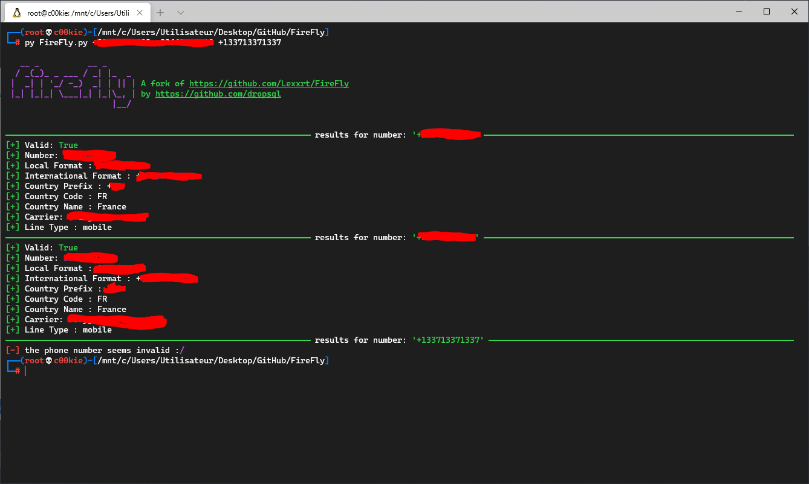

<h2><strong>FireFly</strong></h2>

- *How to use*

>1.  Install python libraries `pip install -r requirements.txt`
>
>2.  Start up the script followed by the phone number `python3 FireFly.py <number 1> <number 2> (etc.)` 
>
>   

- *Disclaimer*

> **This tool is for educational purposes only. I am not responsible for any damage you cause**

- *Output (the \* are sensored informations, hidden by me)*

```
┌──(root💀c00kie)-[/mnt/c/Users/Utilisateur/Desktop/GitHub/FireFly]
└─# py FireFly.py +* +* +133713371337

   __ _          __ _
  / _(_)_ _ ___ / _| |_  _
 |  _| | '_/ -_)  _| | || | A fork of https://github.com/Lexxrt/FireFly
 |_| |_|_| \___|_| |_|\_, | by https://github.com/dropsql
                      |__/


─────────────────────────────────────────────────────────────── results for number: '+*' ────────────────────────────────────────────────────────────────
[+] Valid: True
[+] Number: *
[+] Local Format : *
[+] International Format : +*
[+] Country Prefix : +*
[+] Country Code : *
[+] Country Name : *
[+] Carrier: *
[+] Line Type : mobile
─────────────────────────────────────────────────────────────── results for number: '+*' ────────────────────────────────────────────────────────────────
[+] Valid: True
[+] Number: *
[+] Local Format : *
[+] International Format : +*
[+] Country Prefix : +*
[+] Country Code : *
[+] Country Name : *
[+] Carrier: *
[+] Line Type : mobile
─────────────────────────────────────────────────────────────── results for number: '+133713371337' ───────────────────────────────────────────────────────────────
[-] the phone number seems invalid :/
┌──(root💀c00kie)-[/mnt/c/Users/Utilisateur/Desktop/GitHub/FireFly]
└─#
```

- *NOTE*

> **You can get your own API key from here: https://numverify.com/**
